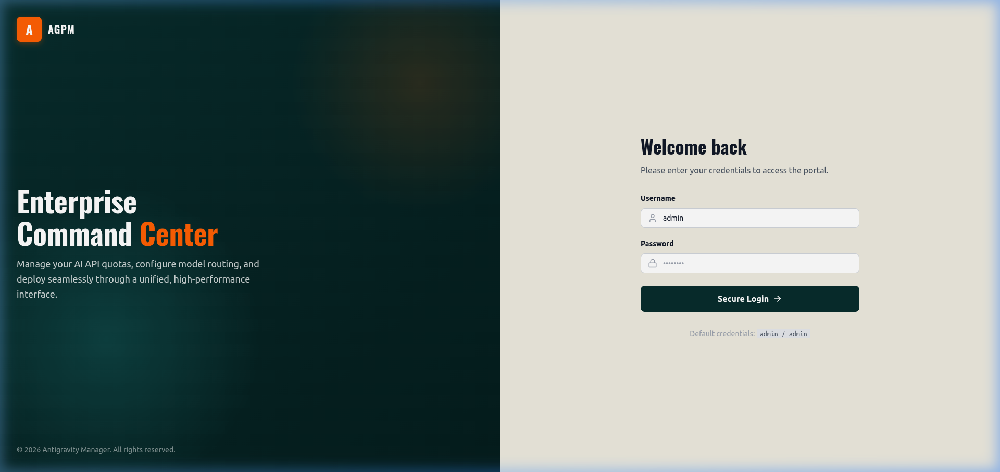
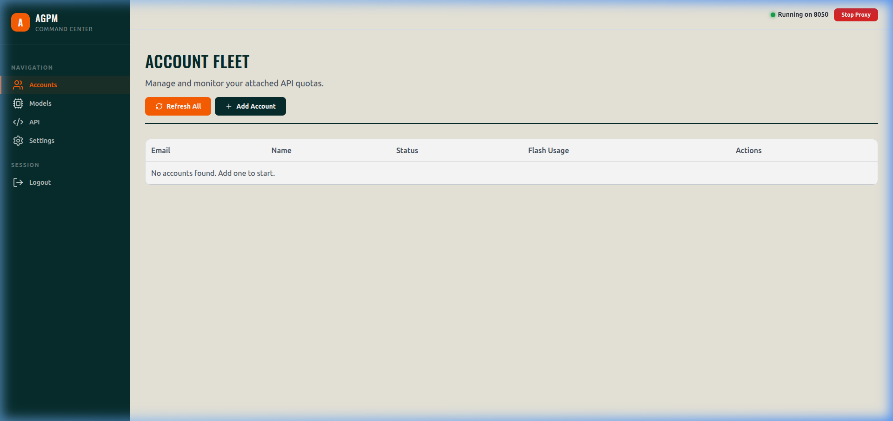
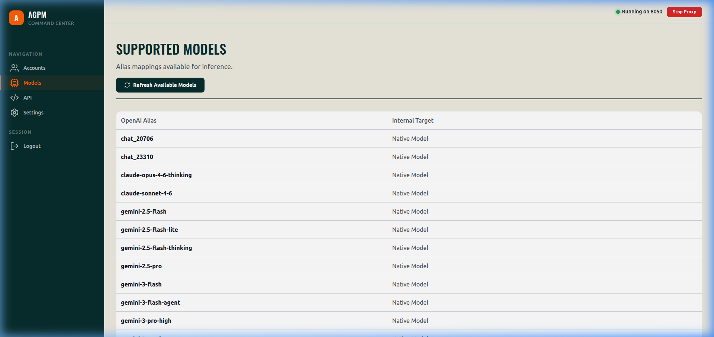
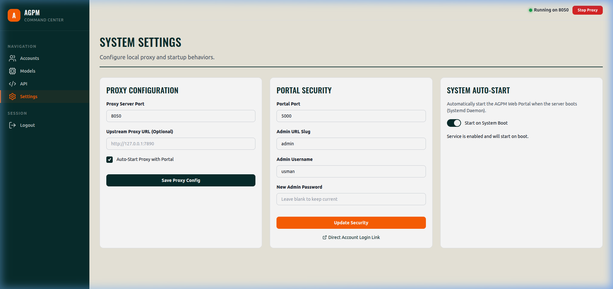

# 🌌 AGPM — Antigravity Proxy Manager

[](https://www.python.org/downloads/)
[](https://opensource.org/licenses/MIT)
[](https://platform.openai.com/docs/api-reference)

**AGPM** is a professional, high-performance OpenAI-compatible proxy server designed to bridge the gap between OpenAI-standard tooling and Google's powerful Gemini models. It provides a unified interface for managing multiple API accounts, rotating quotas, and deploying AI infrastructure seamlessly.

---

## 📸 Interface Preview

### 🔐 Secure Administrative Portal
Professional login interface with robust authentication to protect your API fleet.


### 📊 Account Fleet Management
Monitor live quotas, manage multiple accounts, and track remaining fractions in real-time.


---

## 🚀 Core Features

- **✅ Drop-in OpenAI Compatibility**: Works instantly with any application expecting the `/v1/chat/completions` endpoint.
- **🔄 Intelligent Load Balancing**: Automatically rotates requests across your account fleet using advanced round-robin logic.
- **⚡ High-Performance Streaming**: Native support for Server-Sent Events (SSE) ensures low-latency response streaming.
- **🛡️ Enterprise Security**: Built-in authentication, encrypted token storage, and secure administrative panel.
- **🛠️ Automated Service Management**: Integrated systemd support for one-click "Start on Boot" configuration.
- **📈 Real-time Quota Monitoring**: Deep integration with Google's internal quota APIs to provide accurate usage tracking.

---

## 🛠️ Supported Models

AGPM supports a wide range of models, mapping standard aliases to internal high-performance targets:



- **Gemini Series**: 3.1 Pro (High/Low), 3 Flash, 2.5 Pro/Flash
- **Claude Series**: 3.5 Sonnet, 3.5 Haiku, 3 Opus (via internal routing)
- **GPT Aliases**: Seamlessly map `gpt-4`, `gpt-4o`, and `gpt-3.5-turbo` to Gemini equivalents.

---

## 📦 Quick Start

### Prerequisites
- Python 3.8+
- SQLite3

### Installation

1. **Clone the repository:**
   ```bash
   git clone https://github.com/your-username/AGPM.git
   cd AGPM
   ```

2. **Install dependencies:**
   ```bash
   pip install -r requirements.txt
   ```

3. **Setup environment variables:**
   Copy the example and fill in your Google OAuth credentials:
   ```bash
   cp .env.example .env
   # Edit .env and add your GOOGLE_CLIENT_ID and GOOGLE_CLIENT_SECRET
   ```

4. **Launch the Portal:**
   ```bash
   python web.py
   ```

5. **Initialize:**
   Navigate to `http://localhost:5000` and login with your credentials to start adding accounts.

---

## 🖥️ Service Management (systemd)

AGPM includes built-in support for running as a background service via `systemd`. You can enable this in the **Settings** panel or manage it manually via CLI.

### Manual Commands (User Service)
As AGPM runs as a user-level service, use the `--user` flag:

| Action | Command |
| :--- | :--- |
| **Start** | `systemctl --user start agpm-web.service` |
| **Stop** | `systemctl --user stop agpm-web.service` |
| **Restart** | `systemctl --user restart agpm-web.service` |
| **Status** | `systemctl --user status agpm-web.service` |
| **Enable (Auto-start)** | `systemctl --user enable agpm-web.service` |
| **Disable** | `systemctl --user disable agpm-web.service` |

> [!TIP]
> To view live logs, use: `journalctl --user -u agpm-web.service -f`

---

## 🔌 API Usage

Integrate AGPM into your existing workflow by simply changing the `base_url`.

### Python (OpenAI SDK)
```python
from openai import OpenAI

client = OpenAI(
    base_url="http://localhost:8050/v1",
    api_key="agpm-master-key"
)

response = client.chat.completions.create(
    model="gemini-3.1-pro-high",
    messages=[{"role": "user", "content": "Explain quantum entanglement."}]
)
print(response.choices[0].message.content)
```

### cURL
```bash
curl http://localhost:8050/v1/chat/completions \
  -H "Content-Type: application/json" \
  -H "Authorization: Bearer sk-your-key" \
  -d '{
    "model": "gemini-3-flash",
    "messages": [{"role": "user", "content": "Hello!"}]
  }'
```

---

## ⚙️ Configuration

Configure ports, upstream proxies, and auto-start behavior directly from the **Settings** panel.



---

## 📜 License

Distributed under the MIT License. See `LICENSE` for more information.

---

<p align="center">
  Built with ❤️ by UsmanDevX
</p>
